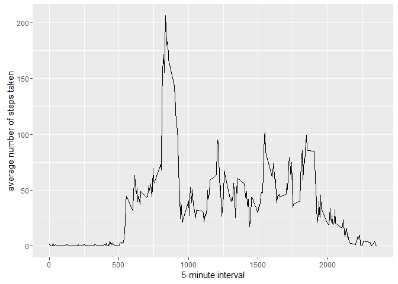

#Reproducible Research: Peer Assessment 1

## Install tools required

```r
#install.packages('knitr', dependencies = TRUE)
#install.packages('ggplot2', dependencies = TRUE)
#install.packages('scales', dependencies = TRUE)
#install.packages('Hmisc', dependencies = TRUE)
```

## import libraries

```r
library(ggplot2)
library(scales)
library(Hmisc)
```

```
## Loading required package: lattice
```

```
## Loading required package: survival
```

```
## Loading required package: Formula
```

```
## 
## Attaching package: 'Hmisc'
```

```
## The following objects are masked from 'package:base':
## 
##     format.pval, round.POSIXt, trunc.POSIXt, units
```

##Loading and preprocessing the data

1.Loading data


```r
if(!file.exists('activity.csv')){
    unzip('activity.zip')
}
activityData <- read.csv('activity.csv')
```

2. Preprocessing of the data

```r
#activityData$interval <- strptime(gsub("([0-9]{1,2})([0-9]{2})", "\\1:\\2", activityData$interval), format='%H:%M')
```
##What is mean total number of steps taken per day?


```r
stepsPerDay <- tapply(activityData$steps, activityData$date, sum, na.rm=TRUE)
```

1. Make a histogram of the total number of steps taken each day


```r
qplot(stepsPerDay, xlab='Total steps per day', ylab='Frequency using binwith 500', binwidth=500)
```

<!-- -->

2.Calculate and report the mean and median total number of steps taken per day


```r
stepsPerDayMean <- mean(stepsPerDay)
stepsPerDayMedian <- median(stepsPerDay)
```

- Mean: 9354.2295082
- Median: 10395

##What is the average daily activity pattern?


```r
averageStepsPerTimeBlock <- aggregate(x=list(meanSteps=activityData$steps), by=list(interval=activityData$interval), FUN=mean, na.rm=TRUE)
```

1. Make a time series plot


```r
ggplot(data=averageStepsPerTimeBlock, aes(x=interval, y=meanSteps)) +
    geom_line() +
    xlab("5-minute interval") +
    ylab("average number of steps taken") 
```

<!-- -->

2.Which 5-minute interval, on average across all the days in the dataset, contains the maximum number of steps?


```r
mostSteps <- which.max(averageStepsPerTimeBlock$meanSteps)
timeMostSteps <-  gsub("([0-9]{1,2})([0-9]{2})", "\\1:\\2", averageStepsPerTimeBlock[mostSteps,'interval'])
```

- Most Steps at: 8:35

##Imputing missing values

1. Calculate and report the total number of missing values in the dataset


```r
numMissingValues <- length(which(is.na(activityData$steps)))
```

- Number of missing values: 2304


2. Devise a strategy for filling in all of the missing values in the dataset.

3. Create a new dataset that is equal to the original dataset but with the missing data filled in


```r
activityDataImputed <- activityData
activityDataImputed$steps <- impute(activityData$steps, fun=mean)
```

4. Make a histogram of the total number of steps taken each day and Calculate and report the mean and median total number of steps taken per day. Do these values differ from the estimates from the first part of the assignment? What is the impact of imputing missing data on the estimates of the total daily number of steps?

4.1 histogram of the total number of steps taken each day


```r
stepsPerDayImputed <- tapply(activityDataImputed$steps, activityDataImputed$date, sum)
qplot(stepsPerDayImputed, xlab='Total steps per day (Imputed)', ylab='Frequency using binwith 500', binwidth=500)
```

<!-- -->


4.2 Calculate and report the mean and median total number of steps taken per day.


```r
stepsPerDayMeanImputed <- mean(stepsPerDayImputed)
stepsPerDayMedianImputed <- median(stepsPerDayImputed)
```


- Mean (Imputed): 1.0766189\times 10^{4}
- Median (Imputed): 1.0766189\times 10^{4}

##Are there differences in activity patterns between weekdays and weekends?

1. Create a new factor variable in the dataset with two levels 
a. weekday
b. weekend
indicating whether a given date is a weekday or weekend day.


```r
activityDataImputed$dateType <-  ifelse(as.POSIXlt(activityDataImputed$date)$wday %in% c(0,6), 'weekend', 'weekday')
```

2. Make a panel plot containing a time series plot


```r
averagedActivityDataImputed <- aggregate(steps ~ interval + dateType, data=activityDataImputed, mean)
ggplot(averagedActivityDataImputed, aes(interval, steps)) + 
    geom_line() + 
    facet_grid(dateType ~ .) +
    xlab("5-minute interval") + 
    ylab("avarage number of steps")
```

<!-- -->


